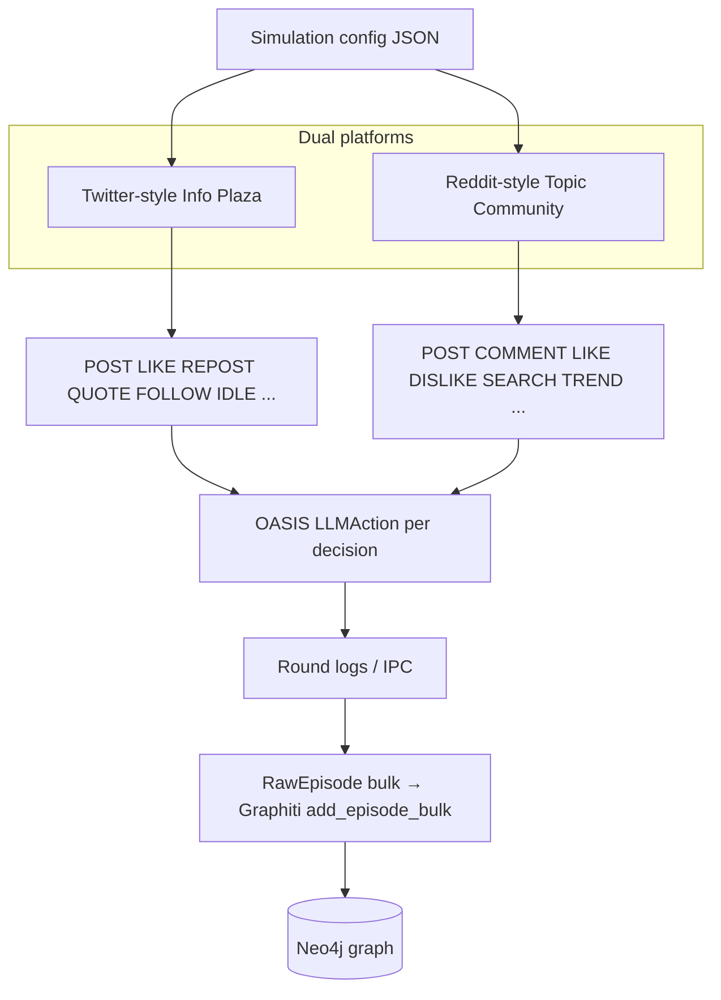
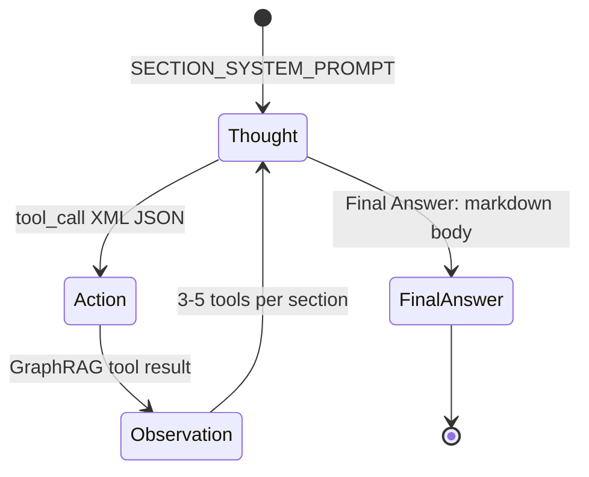
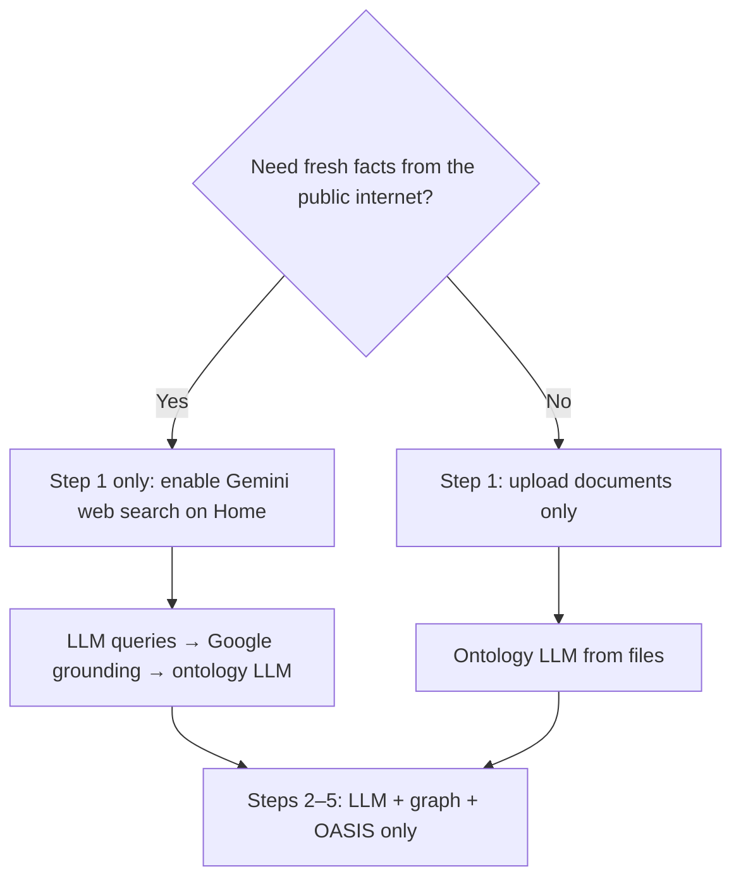

# Explaining MiroFish's 5-Step Simulation Architecture

MiroFish is a multi-agent prediction and simulation engine that bridges static knowledge (GraphRAG on Neo4j + Graphiti) and dynamic social behavior (OASIS parallel agent simulation). This document explains what each step does, which **prompts** drive behavior, and where the system uses **LLM only** versus **LLM + web search (Google Search grounding)** versus **graph retrieval without the public web**.

---

## Intelligence layers at a glance

| Layer | Web search (Google) | Primary LLM (`LLMClient` / configured model) | Other models |
| --- | --- | --- | --- |
| **Step 1 — Ontology** | Optional seed augmentation (Home toggle) | Ontology design from merged corpus | — |
| **Step 1 — Graph build** | No | Graphiti entity/relation extraction per episode chunk | Local embeddings (`BAAI/bge-large-en-v1.5`) |
| **Step 2 — Profiles & config** | No | Personas, time flow, events, per-agent activity JSON | Graph semantic search for sparse entities only |
| **Step 3 — Simulation** | No | Every agent action via OASIS `LLMAction` | Optional boost LLM (`LLM_BOOST_*`) for second platform |
| **Step 4 — Report** | No | Outline, ReACT section drafts, multi-lens analysis, and Composer-driven rewrite | Graph tools; `interview_agents` hits live OASIS; 12-checker Analytical Audit & Epistemic review |
| **Step 5 — Deep interaction** | No | Interview planning, surveys, report chat (multi-lens) | OASIS subprocess LLM for agent replies; Graph tools |

**Web search is only used in Step 1 (ontology seeding), and only when the user enables “Augment seed context with Gemini web search” on Home.** All other steps rely on uploaded documents, the knowledge graph, and simulation logs—not live Google Search.

---

## End-to-end pipeline

```mermaid
flowchart LR
    subgraph inputs [Inputs]
        DOCS[Uploaded documents]
        REQ[Simulation requirement]
        WS_OPT[Optional: Gemini web search toggle]
    end

    subgraph s1 [Step 1: Graph Build]
        RQ[LLM: research queries JSON]
        GS[Vertex Gemini + Google Search grounding]
        ON[LLM: ontology JSON 10 entity types]
        GB[Graphiti LLM extract + local embed → Neo4j]
    end

    subgraph s2 [Step 2: Env Setup]
        PR[LLM: agent personas]
        CF[LLM: time / events / activity config]
    end

    subgraph s3 [Step 3: Simulation]
        OAS[OASIS LLM per agent action]
        MEM[Graphiti bulk episodes → graph]
    end

    subgraph s4 [Step 4: Report]
        PL[LLM: report outline]
        RC[LLM ReACT + graph tools]
        AUD[LLM Audit Checkers & Epistemic Gate]
    end

    subgraph s5 [Step 5: Deep interaction]
        IV[LLM plan + OASIS agent LLM replies]
        TO[Graph tools: InsightForge / Panorama / Quick]
    end

    DOCS --> ON
    REQ --> RQ
    WS_OPT --> RQ
    RQ --> GS
    GS --> ON
    ON --> GB
    GB --> PR
    PR --> CF
    CF --> OAS
    OAS --> MEM
    MEM --> RC
    OAS --> IV
    GB --> RC
    RC --> AUD
    AUD -->|Pass| IV
    AUD -->|Fail: Severity rewrite| RC
```



---

## Step 1: Graph Build — prompts and web search

### When web search runs

```mermaid
sequenceDiagram
    participant User
    participant API as POST /api/graph/ontology/generate
    participant RQ as ResearchQueryGenerator
    participant GS as gemini_web_search
    participant OG as OntologyGenerator
    participant GB as Graph build

    User->>API: files + simulation_requirement + use_vertex_search
    alt use_vertex_search = true
        API->>RQ: LLM chat_json → {"queries": [...]}
        Note over RQ: LLM only (no Google)
        loop each query (parallel, max 10 workers)
            API->>GS: Vertex generate_content + GoogleSearch tool
            Note over GS: LLM + live web grounding
        end
        GS-->>API: merged corpus + source URIs metadata
    end
    API->>OG: documents + web_search_text + requirement
    Note over OG: LLM only
    OG-->>API: entity_types, edge_types, analysis_summary
    User->>GB: POST /api/graph/build
    Note over GB: Graphiti LLM per chunk; local embed; no web
```

| Sub-step | API / module | LLM only? | Web search? | What the prompt asks for |
| --- | --- | --- | --- | --- |
| Research queries | [`ResearchQueryGenerator`](./backend/app/services/research_query_generator.py#L26) | Yes | No | [`RESEARCH_QUERY_SYSTEM`](./backend/app/services/research_query_generator.py#L17): emit JSON `{"queries": [...]}`—short, distinct search strings (actors, timeline, institutions, controversies) from the simulation requirement. |
| Grounding corpus | [`gemini_web_search.search_queries_to_corpus`](./backend/app/services/gemini_web_search.py#L113) | Yes (Vertex model) | **Yes** | Per query: gather factual bullets (actors, roles, relationships, events, timelines) for a **social-media simulation knowledge graph**; uses `types.Tool(google_search=GoogleSearch())`. |
| Ontology | [`OntologyGenerator`](./backend/app/services/ontology_generator.py#L178) | Yes | No (consumes prior corpus) | [`ONTOLOGY_SYSTEM_PROMPT`](./backend/app/services/ontology_generator.py#L32): design **exactly 10** entity types for social-opinion simulation—8 specific types + mandatory fallbacks `Person` and `Organization`; 6–10 edge types; PascalCase / `UPPER_SNAKE_CASE`; no abstract “topics” as entities. User message merges **documents** and optional **“Web search summary (Gemini / Google Search)”** block. |
| Graph ingestion | [`GraphBuilderService`](./backend/app/services/graph_builder.py#L38) + Graphiti | Yes (extraction) | No | No custom prompt in MiroFish—Graphiti’s built-in LLM extracts entities/edges from episode text guided by the ontology. Embeddings: local HuggingFace, not remote embed API. |

**Key endpoints:** `POST /api/graph/ontology/generate`, `POST /api/graph/build`

**Mechanics & Ingestion Enhancements:**
- **Checkpoint Override:** Both ontology generation and graph build endpoints accept a `force` parameter (triggered in the UI via the "Regenerate Ontology" and "Rebuild Graph" actions). This ignores previously generated checkpoints (`ontology_generated`, `graph_completed`) to allow a fresh end-to-end rebuild.
- **Graphiti Client Alignment:** Aligns Graphiti's edge de-duplication and background small tasks to use the primary configured LLM model (such as `gpt-4o-mini`, `gemini-3.5-flash`), preventing separate provider setup.
- **Ollama Isolation:** When `LLM_PROVIDER` is set to `ollama`, the system isolates Ollama-specific environment variables (`OPENAI_API_KEY`, `OPENAI_BASE_URL`, `MODEL_NAME`) to prevent local or cloud variable leakage.
- **Vector Dimension Cleanup:** Includes the `backend/scripts/cleanup_neo4j_embedding_dimensions.py` script. This scans node embedding properties ending in `_embedding`, detects outlier dimensions, and purges mismatched properties to prevent similarity matching errors during GraphRAG queries.
- **Other highlights:** PascalCase relation normalization; parallel Graphiti ingestion (`GRAPHITI_SEMAPHORE_LIMIT`); check-pointed resume; `GRAPHITI_BATCH_SIZE` batching with local `BAAI/bge-large-en-v1.5` embeddings.

---

## Step 2: Env Setup — LLM prompts only

No web search. Optional **graph semantic search** enriches sparse entity context before persona LLM calls (not the public web).

| Sub-step | Module | Prompt role / links |
| --- | --- | --- |
| Agent personas | [`OasisProfileGenerator`](./backend/app/services/oasis_profile_generator.py#L142) | [`_get_system_prompt`](./backend/app/services/oasis_profile_generator.py#L808): *“social media user persona expert… valid JSON only.”* User: [`_build_individual_persona_prompt`](./backend/app/services/oasis_profile_generator.py#L813) (~2000-word `persona`, `bio`, `age`, `gender`, `mbti`, …) or [`_build_group_persona_prompt`](./backend/app/services/oasis_profile_generator.py#L862) (fixed `age=30`, `gender=other`). Context truncated from graph neighbors when needed. |
| Time flow | [`SimulationConfigGenerator._generate_time_config`](./backend/app/services/simulation_config_generator.py#L606) | Generates JSON config via [inline prompt](./backend/app/services/simulation_config_generator.py#L614): `total_simulation_hours`, `minutes_per_round`, peak/off-peak/work hours, `agents_per_hour_*`, with audience-specific reasoning. |
| Seed events | [`_generate_event_config`](./backend/app/services/simulation_config_generator.py#L718) | Generates JSON config via [inline prompt](./backend/app/services/simulation_config_generator.py#L748): initial posts, `poster_type` (must match ontology entity types in English PascalCase), narratives, hot topics. |
| Per-agent activity | [`_build_agent_config_batch_prompt`](./backend/app/services/simulation_config_generator.py#L891) | Generates JSON batch via [inline prompt](./backend/app/services/simulation_config_generator.py#L908): stances (`supportive` / `opposing` / `neutral` / `observer` in English), activity levels aligned with circadian config. |

**Key endpoints:** `POST /api/simulation/create`, `POST /api/simulation/prepare`, `POST /api/simulation/config`

**Mechanics:** O(edges) entity enrichment; skip redundant graph search when context is already rich; async `AsyncOpenAI` + `asyncio.gather` with `SIM_CONFIG_MAX_WORKERS`.

---

## Step 3: Run Simulation — LLM only (OASIS)



| Component | LLM? | Web? | Notes |
| --- | --- | --- | --- |
| Agent decisions | Yes | No | [`run_parallel_simulation.py`](./backend/scripts/run_parallel_simulation.py) / platform scripts ([`run_twitter_simulation.py`](./backend/scripts/run_twitter_simulation.py), [`run_reddit_simulation.py`](./backend/scripts/run_reddit_simulation.py)); optional `LLM_BOOST_*` for second provider. |
| Interview during sim | Yes | No | Prompt prefix `INTERVIEW_PROMPT_PREFIX`: *“Based on your persona… reply directly without calling any tools.”* defined in [`simulation.py`](./backend/app/api/simulation.py#L26) and [`zep_tools.py`](./backend/app/services/zep_tools.py#L1364). |
| Graph memory update | Graphiti LLM on episode text | No | Posts/comments → concurrent `add_episode_bulk` in [`graphiti_graph_memory_updater.py`](./backend/app/services/graphiti_graph_memory_updater.py#L58). |

**Key endpoints:** `POST /api/simulation/start`, `POST /api/simulation/stop`, `GET /api/simulation/status`

---

## Step 4: Report Generation — ReACT LLM + graph tools

All report writing prompts frame the simulation as a **“future prediction rehearsal”** (god’s-eye view of injected conditions). Content must come from tools/simulation data, not model world knowledge.

### Planning (LLM only)

| Prompt | Purpose |
| --- | --- |
| [`PLAN_SYSTEM_PROMPT`](./backend/app/services/report_agent.py#L552) | Expert for **future prediction report**; 2–5 sections, no subsections; JSON `{title, summary, sections[]}`. |
| [`PLAN_USER_PROMPT_TEMPLATE`](./backend/app/services/report_agent.py#L591) | Injects simulation requirement, graph scale (nodes/edges/types), sample related facts. |

### Section writing (LLM + tools, no web)



| Prompt / tool | LLM? | Web? | Behavior |
| --- | --- | --- | --- |
| [`SECTION_SYSTEM_PROMPT_TEMPLATE`](./backend/app/services/report_agent.py#L615) | Yes | No | Rules: ≥3 tool calls, cite agent quotes, no `#` headings in body, translate quotes to report language. |
| [`insight_forge`](./backend/app/services/zep_tools.py#L957) | LLM decomposes query → sub_queries JSON; then **graph search only** | No | Sub-query system prompt defined in [`_generate_sub_queries`](./backend/app/services/zep_tools.py#L1104): split complex question into observable simulation dimensions. |
| [`panorama_search`](./backend/app/services/zep_tools.py#L1157) | No | No | Full graph scan + temporal active/expired facts (BFS-style breadth). |
| [`quick_search`](./backend/app/services/zep_tools.py#L1249) | No | No | Fast semantic edge search. |
| [`interview_agents`](./backend/app/services/zep_tools.py#L1284) | LLM selects agents + generates questions; **OASIS LLM** answers | No | Not a web interview—live simulation API. |

Streaming: thoughts and tool I/O → `agent_log.jsonl` (live UI timeline).

**Key endpoints:** `POST /api/report/generate`, `GET /api/report/status`

### Analytical Scaffold and Epistemic Control Layer

MiroFish integrates an advanced hierarchical quality-gating, epistemic discrimination, and automated post-generation audit system to ensure rigorous, defensible, and analytical prediction reasoning instead of retail SEO storytelling.

#### 1. Evidence Scoring & Epistemic Hierarchy

Before synthesis, every retrieved evidence chunk is classified and evaluated by the system using two key services:
* **`EpistemicDiscriminator`**: Categorizes each source into one of seven trust tiers. These tiers determine a hard **credibility cap** and **maximum thesis share** that the source can anchor:
  * `SIMULATION_PRIMARY` (interview_agents / live simulation ground truth — Cap: `1.0`, Max Share: `45%`, Ceiling: `HIGH`)
  * `INSTITUTIONAL` (SEC filings, regulatory filings, tier-1 financial wire services — Cap: `0.92`, Max Share: `40%`, Ceiling: `HIGH`)
  * `PROFESSIONAL` (Graph retrieval, established business press — Cap: `0.78`, Max Share: `35%`, Ceiling: `MEDIUM`)
  * `ANALYST_ACTION` (Analyst rating or price target changes — Cap: `0.52`, Max Share: `20%`, Ceiling: `LOW`)
  * `RETAIL_COMMENTARY` (Retail investor media, generic finance blogs — Cap: `0.32`, Max Share: `12%`, Ceiling: `TENTATIVE_ONLY`)
  * `SOCIAL_OPINION` (LinkedIn, social media posts, comments, forums — Cap: `0.18`, Max Share: `8%`, Ceiling: `TENTATIVE_ONLY`)
  * `SPECULATIVE` (Rumors, unconfirmed reports — Cap: `0.12`, Max Share: `8%`, Ceiling: `TENTATIVE_ONLY`)
* **`EvidenceEvaluator`**: Scores retrieved evidence chunks dynamically on:
  * *Credibility* (tool-based baseline, capped by epistemic tier)
  * *Relevance* (semantic overlap with section title & simulation requirements)
  * *Recency* (source freshness score)
  * *Specificity* (key and quantified claims count)
  * *Strategic Materiality* (presence of financial terms like margins, revenues, USD values)
  * *Durability* (detects structural/long-term signals vs ephemeral breaking rumors)
  These metrics combine into a unified `synthesis_weight`. Hard caps guarantee that search salience cannot override epistemic tiers. Weak sources (retail/social/speculative) are explicitly annotated: `(tentative sentiment / low epistemic weight)`.

#### 2. Markdown Scaffolding Rules (Enforced on ReACT Writer)

The system injects strict formatting and structuring constraints directly into the section writer's prompt:
* **Risk-First Ordering**: Systemic vulnerabilities, downside scenarios, friction points, and potential failure modes must be analyzed *before* describing optimistic or smooth trajectories.
* **Causal Chain Scaffold**: Every major finding or claim must follow a complete causal-chain:
  `Event / Observation → Operational Impact → Financial/Economic Impact → Strategic Implications → Vulnerability/Risk Invalidation`
  *(e.g., in markets: deal premium → funding mix → dilution/accretion → EPS/valuation multiple → synergy realization risk).*
* **Probabilistic Scenario Mapping**: Sections must conclude with a clear scenario block covering **Base Scenario** (with rough probability band, e.g., 60-70%), **Bear Scenario** (downside trajectory, probability band, e.g., 20-30%), and **Bull Scenario** (upside trajectory, probability band, e.g., 10%), each specifying an exact falsifiable trigger condition (actions/metrics).
* **Retrieval Contamination Guardrail / Thesis Balancing**: No single source may anchor more than ~40% of factual claims. Multi-lens synthesis must balance structural, cyclical, macro, fundamental, and episodic drivers.
* **Quantitative and Valuation Grounding**: Findings must be grounded in precise figures, margins, percentages, or monetary valuation metrics instead of vague qualitative narratives.

#### 3. Analytical Audit & Post-Generation Verification Checkers

Once a section is drafted, the system executes **12 automated verification checkers** to audit the draft. Failures generate diagnostic logs and increment a cumulative severity score. If the cumulative score exceeds a threshold (default `3`), the system triggers a **Composer-driven confidence-governed rewrite** of the section.

The 12 checkers include:
1. **`GroundingVerifier`**: Flags unanchored factual claims that do not cite source numbers inline (e.g., missing `[S1]`).
2. **`ContradictionDetector`**: Identifies internal contradictions within drafted text.
3. **`NumericalSanityChecker`**: Scans for anomalous figures or conflicting quantitative units.
4. **`SpecificityDetector`**: Identifies vague filler sentences that should be removed or specified.
5. **`ConfidenceCoverageChecker`**: Verifies speculative statements carry appropriate calibration labels, and flags overconfident unbacked claims.
6. **`SkepticismChecker`**: Captures overstated certainty or confidence-credibility mismatches (e.g., citing a low-credibility retail source as definitive fact).
7. **`EvidenceAlignmentChecker`**: Directly cross-checks claimed numbers and percentages in the draft against raw source data to prevent LLM hallucinations.
8. **`AnchoringDistributionChecker`**: Flags single-source concentration risk (claims overly anchored on a single retrieved context, exceeding ~40%).
9. **`CausalCompletenessChecker`**: Pinpoints gaps in the required causal-chain scaffold (missing operational, financial, or strategic links).
10. **`NumericalGroundingCoverageChecker`**: Flags financial terminology (revenue, valuation, margin) that lacks corresponding numbers or quantities.
11. **`ThesisBalanceChecker`**: Warns if the narrative is overfitted to a single salient retrieved theme instead of balancing multiple driver lenses.
12. ****`EpistemicReviewChecker`**: Checks for weak epistemic source citations (evidence quality collapse) and overconfident claims built on weak epistemic tiers.

---

## Step 5: Deep Interaction — LLM + graph + OASIS

| Feature | LLM | Web | Graph / sim |
| --- | --- | --- | --- |
| [`POST /api/simulation/interview/batch`](./backend/app/api/simulation.py#L2367) | OASIS agent replies | No | Direct subprocess interview |
| Report chat ([`CHAT_SYSTEM_PROMPT_TEMPLATE`](./backend/app/services/report_agent.py#L829)) | Yes, ≤2 tool calls | No | Optional same GraphRAG tools |
| InsightForge / Panorama / QuickSearch | Sub-query LLM for [`insight_forge`](./backend/app/services/zep_tools.py#L957) only | No | Neo4j / Graphiti retrieval |
| Survey flows | LLM for design/synthesis where implemented | No | Batch agent prompts |

**Interview agent selection prompt**: [`_select_agents_for_interview`](./backend/app/services/zep_tools.py#L1563) (choose diverse indices from persona list JSON `{"selected_indices": [...], "reasoning": "..."}`).

**Question generation**: [`_generate_interview_questions`](./backend/app/services/zep_tools.py#L1646) (3–5 open-ended JSON `{"questions": [...]}`).

**Synthesis prompt**: [`_generate_interview_summary`](./backend/app/services/zep_tools.py#L1700) (editor-style recap from multiple respondent answers).

---

## Configuration reference (web search)

From `.env.example` (optional Step 1 only):

- `VERTEX_AI_PROJECT_ID`, `VERTEX_AI_LOCATION` — required for grounding
- `GEMINI_WEB_SEARCH_MODEL` — Vertex GenAI model id (e.g. `gemini-3.1-flash-lite`)
- `GEMINI_WEB_SEARCH_MAX_QUERIES`, `GEMINI_WEB_SEARCH_MAX_CHARS`, `GEMINI_WEB_SEARCH_MAX_OUTPUT_TOKENS`

Verify: `npm run verify:gemini` / `cd backend && uv run python scripts/verify_gemini_web_search.py`

---

## Quick decision guide



- **“LLM only”** — standard chat/completions/json via `LLMClient` (or Vertex/OpenAI-compatible config).
- **“LLM + web”** — Vertex `generate_content` with `GoogleSearch` tool in `gemini_web_search.py` (after query generation).
- **“No LLM”** — rare; mostly graph reads (`panorama_search`, `quick_search`) and deterministic transforms (PascalCase normalization, checkpoints, local embeddings).

---

## Related UI

- **Home:** simulation requirement, file upload, optional **Gemini web search** toggle (`use_vertex_search`).
- **Process / Step1GraphBuild:** progress strings for web search query count and grounding metadata (`web_search_chars`, source URIs).
- **Report view:** ReACT timeline from `agent_log.jsonl`.

For runnable smoke context, see [`samples/smoke-test/README.md`](./samples/smoke-test/README.md).
