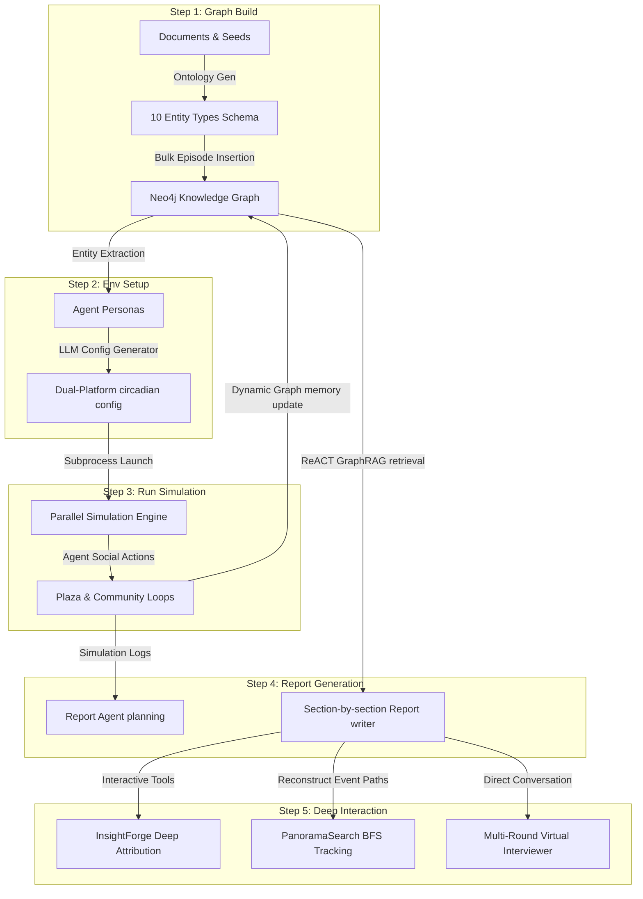

# Explaining MiroFish's 5-Step Simulation Architecture

We have created an interactive **Cursor Canvas** (`canvases/mirofish-steps.canvas.tsx`) that visualizes the complete system architecture, data flows, key API endpoints, and internal mechanics of MiroFish. You can open and explore this canvas side-by-side with our chat!

Below is a detailed, concrete technical overview of how each of the 5 steps works under the hood.

---

## Architecture Overview

MiroFish is a multi-agent prediction and simulation engine that bridges static knowledge bases (using a GraphRAG temporal knowledge graph with Neo4j & Graphiti) and dynamic human behaviors (using OASIS parallel agent simulation).

The workflow follows a sequential pipeline where each stage feeds structural and contextual data to the next:

---

## Detailed Breakdown of the 5 Steps

### Step 1: Graph Build (Ontology & GraphRAG)
- **Core Purpose**: Extract structural semantics and "reality seeds" from raw source text to build a robust GraphRAG database using Neo4j and Graphiti.
- **Key API Endpoints**:
  - `POST /api/graph/ontology/generate`
  - `POST /api/graph/build`
- **Under the Hood Mechanics & Algorithmic Details**:
  - **Ontology Generation**: The LLM analyzes source files and designs exactly 10 entity types. To ensure extreme structural safety and flexibility, the list must include specific types (like `Professor`, `Student`, etc.) plus two fallback types: `Person` and `Organization`.
  - **Name PascalCase Normalization**: Any arbitrary relation names from texts are normalized into PascalCase or UPPER_SNAKE_CASE (e.g., `"works_for" -> "WorksFor"`) to avoid duplicate relation types.
  - **Parallel Graphiti Ingestion**: Bounded async concurrency via `GRAPHITI_SEMAPHORE_LIMIT` and `asyncio.gather` inserts chunks in parallel. This is fault-tolerant with pipeline retries.
  - **Checkpoint Resumption**: Progress is strictly checkpointed (e.g., `ontology_generated`, `graph_completed`). Retries hydrate the project state from payloads, completely avoiding re-running LLM and ensuring speed without accuracy loss.
  - **Zero-Latency Local Embeddings**: Instead of remote API calls, Graphiti utilizes a local HuggingFace embedding model (`BAAI/bge-large-en-v1.5`) running `langchain-huggingface`. This allows O(1) embedding latency, removes rate limits, and uses batch processing (`GRAPHITI_BATCH_SIZE`) to saturate coroutines for massive throughput.

### Step 2: Env Setup (Circadian Orchestration)
- **Core Purpose**: Extract individual entities from the Graph database, generate multi-dimensional psychological agent profiles, and set dual-platform active rhythms.
- **Key API Endpoints**:
  - `POST /api/simulation/create`
  - `POST /api/simulation/prepare`
  - `POST /api/simulation/config`
- **Under the Hood Mechanics & Algorithmic Details**:
  - **Agent Profile Generation**: Maps node attributes to structured agent profiles containing `username`, `bio`, `persona`, `age`, `gender`, `mbti`, and `profession`.
  - **Diurnal Timeflow Configuration**: Auto-calculates circadian active hours based on real-world timezone modeling. Active multipliers represent daily behaviors (e.g. late-night dead hour at 0.05 vs evening peak hour at 1.5).
  - **Algorithm Configuration**: Configures recommendation algorithms (recency vs popularity vs relevance weight) and initial event/topic sequences to seed the world state.
  - **Optimized Graph Entity Enrichment**: Entities are loaded via pre-indexed edges by UUID in O(edges) total time (instead of O(nodes×edges)), massively reducing CPU load on large graph fetches.
  - **Conditional Graph Search Caching**: Redundant profile graph search is automatically skipped if context is rich enough (i.e. if existing related edges/nodes provide sufficient facts). Only sparse entities invoke deep GraphRAG context fetching.
  - **Async LLM Batch Generation**: Both profile extraction and simulation config generators utilize `AsyncOpenAI`/`asyncio.gather` for independent, high-throughput parallel HTTP generation. Worker limits are configurable (`SIM_CONFIG_MAX_WORKERS`) without compromising batch integrity.

### Step 3: Run Simulation (Dual-World Parallel Simulation)
- **Core Purpose**: Run parallel round-based simulation loops across Twitter-style (Info Plaza) and Reddit-style (Topic Community) social platforms.
- **Key API Endpoints**:
  - `POST /api/simulation/start`
  - `POST /api/simulation/stop`
  - `GET /api/simulation/status`
- **Under the Hood Mechanics & Algorithmic Details**:
  - **Action Matrix**: Info Plaza agents can POST, LIKE, REPOST, QUOTE, FOLLOW, or IDLE. Topic Community agents can POST, COMMENT, LIKE, DISLIKE, SEARCH, TREND, FOLLOW, MUTE, REFRESH, or IDLE.
  - **IPC Pipeline**: Uses `SimulationIPCClient` with custom command structures (START, STATUS, PAUSE) to pipe stdout/stderr and synchronise round execution.
  - **Dynamic Graph memory update (Bulk Insertion)**: Posts and comments are parsed in real-time. Instead of one huge sequential text payload, activities are formatted as separated `RawEpisode` objects and inserted concurrently using Graphiti's `add_episode_bulk`, dynamically maintaining the temporal knowledge graph.

### Step 4: Report Generation (ReACT GraphRAG Report Agent)
- **Core Purpose**: Employ a LangChain-powered ReACT agent to inspect the complete simulation history and synthesize a customized predictive report.
- **Key API Endpoints**:
  - `POST /api/report/generate`
  - `GET /api/report/status`
- **Under the Hood Mechanics & Algorithmic Details**:
  - **Planning Phase**: First generates a customized multi-section table of contents (TOC) matching user prediction goals.
  - **ReACT Reflection**: Generates segment-by-section. For each segment, the agent runs a "Thought-Action-Observation-Reflection" loop, dynamically deciding which GraphRAG tools to call before writing section content.
  - **Streaming Logs**: Real-time thoughts, tool responses, and content compilation are written to `agent_log.jsonl`, which is rendered as a live timeline in the frontend.

### Step 5: Deep Interaction (Agent Interview & Tools)
- **Core Purpose**: Empower users to interrogate the simulation outputs, test counter-narratives, and conduct unstructured psychological interviews with specific agents.
- **Key API Endpoints**:
  - `POST /api/simulation/interview/batch`
  - `POST /api/simulation/survey`
- **Advanced Diagnostic Toolkit**:
  - **InsightForge**: Hybrid attribution that aligns real-world seed data with simulation history, combining Global and Local memory.
  - **PanoramaSearch**: Graph-based BFS traversal to reconstruct exact propagation paths across temporal/active facts.
  - **QuickSearch**: Optimized fast semantic search for attributes and discrete nodes.
  - **InterviewSubAgent**: Parallelized multi-round virtual interviewer that queries specific simulated agents in first-person with cognitive alignment.
